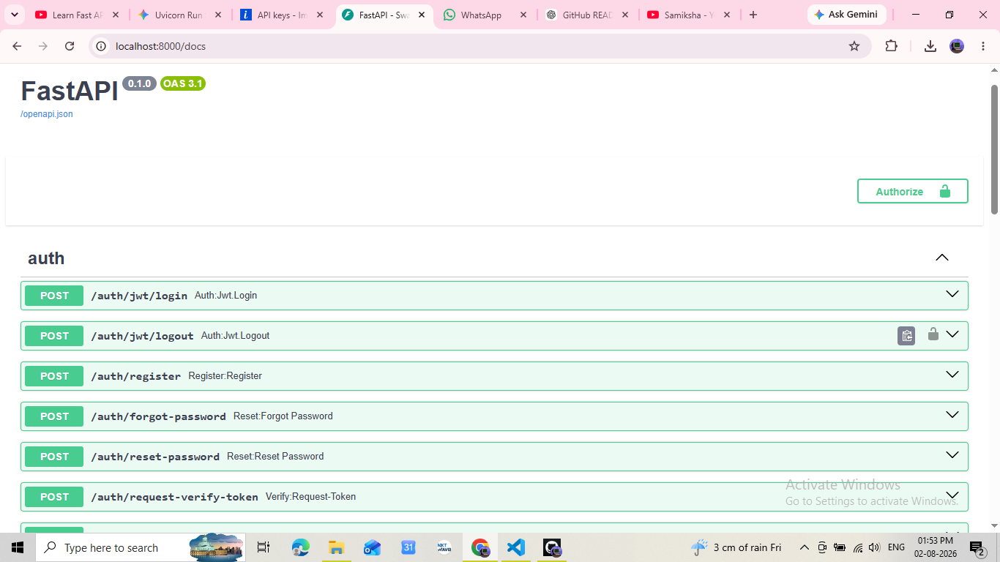
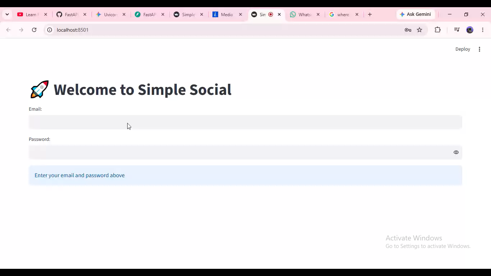
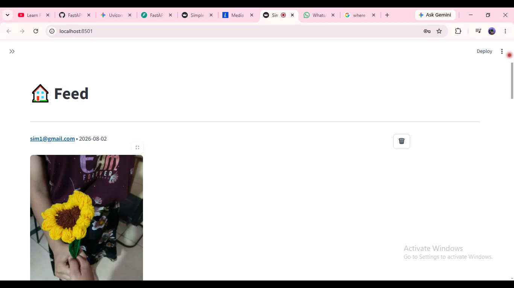
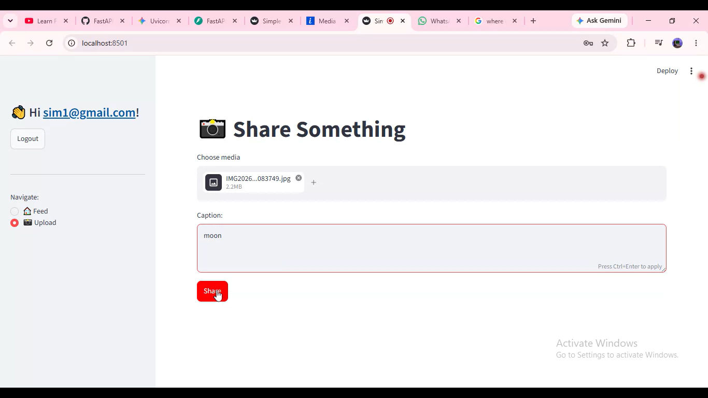
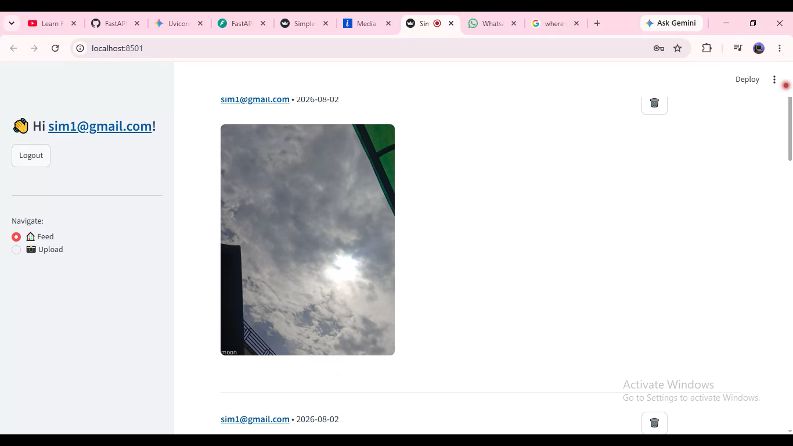

# 📸 SimpleSocial

A social media web application inspired by Instagram, built using FastAPI,
SQLAlchemy and Streamlit.

---

## 🚀 Features

- User Registration
- ImageKit.io Integration
- User Login (JWT Authentication)
- Secure Authentication
- Upload Images and Videos
- Media storage using ImageKit.io
- Feed displaying uploaded media
- FastAPI REST APIs
- SQLAlchemy ORM integration
- Streamlit frontend
---
## Architecture
Streamlit Frontend
        │
        ▼
FastAPI REST API
        │
        ▼
SQLAlchemy ORM
        │
        ▼
SQLite Database
        │
        ▼
ImageKit.io

---
## 🛠 Tech Stack

Backend
- FastAPI
- SQLAlchemy
- Python

Frontend
- Streamlit

Database
- SQLite / PostgreSQL

Others
- Uvicorn
- Pydantic

---

## 📂 Project Structure

app/
src/
frontend.py
main.py

---

## ⚙ Installation

git clone ...

cd SimpleSocial

pip install -r requirements.txt

uvicorn main:app --reload

streamlit run frontend.py

---
## 📖 API Documentation

### Swagger UI

---

## 📸 Application Screenshots

### Login Page

### Feed

### Create Post

### Uploaded Post

---

## 🎥 Demo Video

Watch the project demo here:

[▶️ Watch Demo on YouTube])

(https://youtu.be/l-nbuvkBM6k?si=vlkURCuLi7vizHDk)

---
## Learning Outcomes

Built this project to learn

- REST APIs
- SQLAlchemy ORM
- FastAPI Routing
- Database Relationships
- Authentication
- Streamlit Integration

---
## Media Storage

Images and videos are uploaded using **ImageKit.io**, while the backend built with FastAPI handles authentication, media metadata, and feed management.

---

## Author

Samiksha Kaushik
